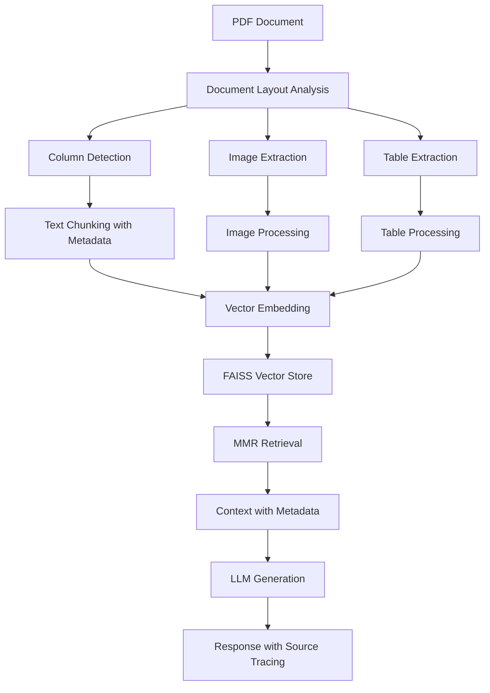
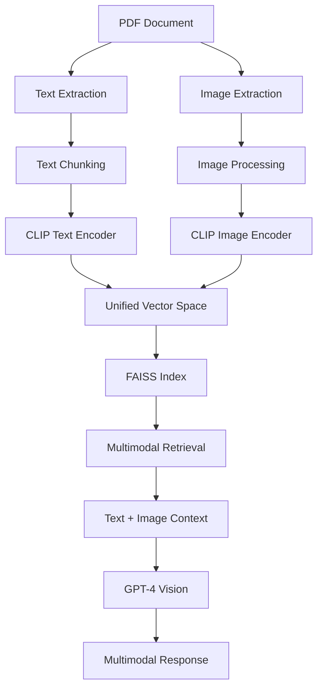
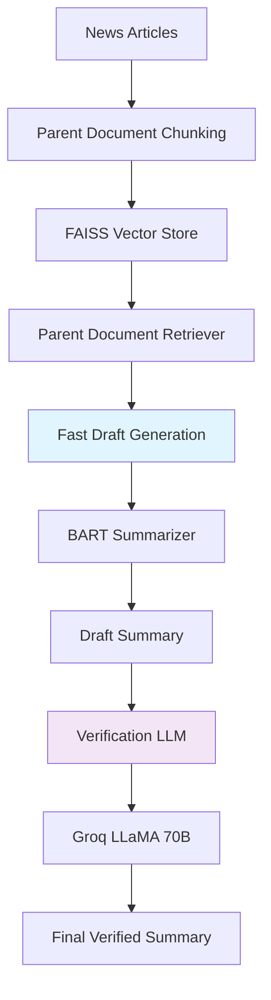
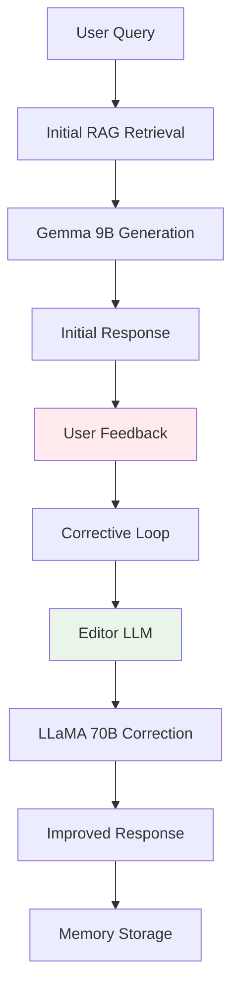
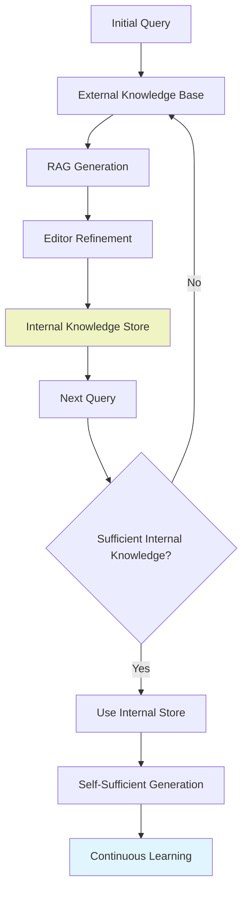
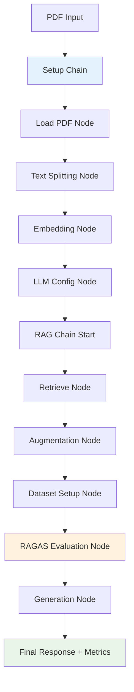
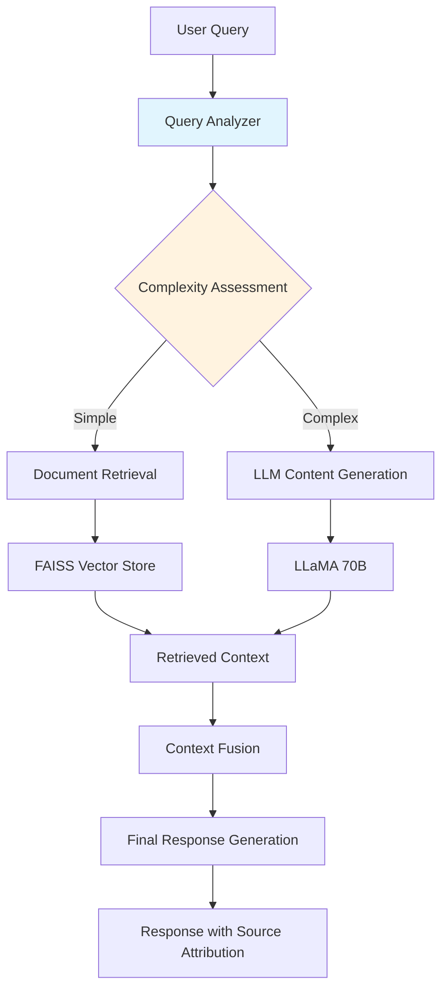
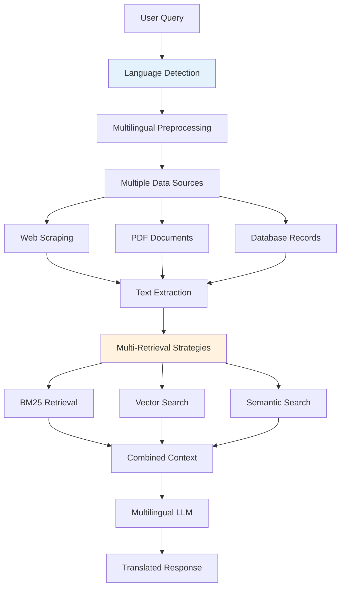
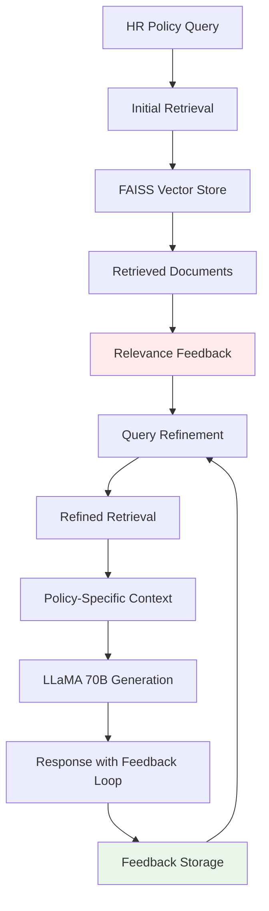

# 🚀 Advanced RAG Experiments Repository

[](https://www.python.org/downloads/)
[](https://python.langchain.com/)
[](LICENSE)
[](CONTRIBUTING.md)

> A comprehensive collection of advanced Retrieval-Augmented Generation (RAG) implementations, exploring cutting-edge techniques for document understanding, multimodal processing, and intelligent information retrieval.

---

## 📚 Table of Contents

- [🎯 Overview](#overview)
- [🔧 RAG Implementations](#rag-implementations)
  - [RAG with Metadata & Document Layout Analysis](#1-rag-with-metadata--document-layout-analysis)
  - [MultiModal RAG with CLIP Image Embedding](#2-multimodal-rag-with-clip-image-embedding)
  - [Speculative RAG with News Outlet Summary](#3-speculative-rag-with-news-outlet-summary)
  - [Corrective RAG](#4-corrective-rag)
  - [Self-RAG](#5-self-rag)
  - [Agentic RAG](#6-agentic-rag)
  - [Adaptive RAG: Smart Retrieval from DOC or LLM](#7-adaptive-rag-smart-retrieval-from-doc-or-llm)
  - [Fusion RAG: MultiSource-MultiRetrieval-MultiLingual](#8-fusion-rag-multisource-multiretrieval-multilingual)
  - [REFEED (Retrieval Feedback) HR Policy Fine-Tuning Without Training](#9-refeed-retrieval-feedback-hr-policy-fine-tuning-without-training)
- [🛠️ Installation](#installation)
- [📊 Performance Comparison](#performance-comparison)
- [🚀 Quick Start](#quick-start)
- [📈 Future Roadmap](#future-roadmap)
- [🤝 Contributing](#contributing)
- [📚 Resources & References](#resources--references)
- [📄 License](#license)
- [🙏 Acknowledgments](#acknowledgments)
- [📊 Repository Statistics](#repository-statistics)

---

## 🎯 Overview

This repository showcases **nine advanced RAG implementations** that push the boundaries of traditional retrieval-augmented generation. Each implementation tackles specific challenges in document understanding, multimodal processing, and intelligent information retrieval.

### 🌟 Key Features

- **Advanced Document Processing**: Layout analysis, metadata extraction, and multi-column handling
- **Multimodal Understanding**: Combined text and image processing with CLIP embeddings
- **Self-Improving Systems**: Corrective and self-reflective RAG architectures
- **Agentic Workflows**: Graph-based RAG with integrated evaluation metrics
- **Production-Ready**: Robust error handling and optimization techniques
- **Adaptive Retrieval**: Dynamic strategy selection for optimal performance
- **Multisource Retrieval**: Combining multiple data sources and retrieval methods
- **Feedback-Driven Fine-Tuning**: Enhancing performance without traditional training

---

## 🔧 RAG Implementations

### 1. RAG with Metadata & Document Layout Analysis

**🎯 Purpose**: Intelligent document parsing with layout understanding and metadata preservation



**🔑 Key Features**:
- **Two-column detection** for academic papers
- **Metadata preservation** (page numbers, chunk IDs)
- **Multi-asset extraction** (images, tables, text)
- **Source traceability** in responses

**📊 Technical Stack**:
- `pdfplumber` for text extraction
- `PyMuPDF` for image extraction
- `HuggingFace Embeddings` for vectorization
- `FAISS` for similarity search
- `Groq LLaMA` for generation

### 2. MultiModal RAG with CLIP Image Embedding

**🎯 Purpose**: Unified text and image understanding using CLIP embeddings



**🔑 Key Features**:
- **CLIP-based embeddings** for text-image alignment
- **Unified vector space** for multimodal search
- **Visual context integration** in responses
- **Cross-modal retrieval** capabilities

**📊 Technical Stack**:
- `OpenAI CLIP` for multimodal embeddings
- `PIL` for image processing
- `sentence-transformers` for text embeddings
- `OpenAI GPT-4` for generation

### 3. Speculative RAG with News Outlet Summary

**🎯 Purpose**: Fast draft generation with verification for real-time news processing



**🔑 Key Features**:
- **Two-stage generation** (draft + verification)
- **Parent document retrieval** for context preservation
- **Fast local summarization** with BART
- **Large model verification** with Groq

**📊 Technical Stack**:
- `ParentDocumentRetriever` for hierarchical retrieval
- `BART` for fast summarization
- `Groq LLaMA 70B` for verification
- `NewsAPI` for real-time data

### 4. Corrective RAG

**🎯 Purpose**: Human-in-the-loop correction system for improved accuracy



**🔑 Key Features**:
- **Dual LLM architecture** (generator + editor)
- **Human feedback integration**
- **Conversation memory** for context
- **Iterative improvement** process

**📊 Technical Stack**:
- `Gemma 9B` for initial generation
- `LLaMA 70B` for correction
- `ConversationBufferMemory` for context
- `Pydantic` for structured output

### 5. Self-RAG

**🎯 Purpose**: Self-improving RAG system with internal knowledge accumulation



**🔑 Key Features**:
- **Self-sufficient knowledge building**
- **Dual retrieval system** (internal + external)
- **Continuous learning** from outputs
- **Adaptive retrieval** strategy

**📊 Technical Stack**:
- `Gemma 9B` for generation
- `LLaMA 70B` for editing
- `FAISS` for dual storage
- `MMR` for diverse retrieval

### 6. Agentic RAG

**🎯 Purpose**: Graph-based RAG workflow with integrated evaluation metrics



**🔑 Key Features**:
- **Graph-based workflow** with LangGraph
- **Integrated RAGAS evaluation** for quality metrics
- **Modular node architecture**
- **State management** and checkpointing

**📊 Technical Stack**:
- `LangGraph` for workflow orchestration
- `RAGAS` for evaluation metrics
- `GPT-4` for high-quality generation
- `InMemorySaver` for state persistence

### 7. Adaptive RAG: Smart Retrieval from DOC or LLM

**🎯 Purpose**: Dynamically selects between document-based retrieval and LLM-generated content based on query complexity and context



**🔑 Key Features**:
- **Query complexity analysis** for dynamic source selection
- **Hybrid retrieval** combining document and LLM outputs
- **Context fusion** for coherent responses
- **Source attribution** for transparency

**📊 Technical Stack**:
- `LangChain` for query analysis
- `FAISS` for document retrieval
- `Groq LLaMA 70B` for content generation
- `sentence-transformers` for embeddings

### 8. Fusion RAG: MultiSource-MultiRetrieval-MultiLingual

**🎯 Purpose**: Combines multiple data sources, retrieval strategies, and multilingual processing for robust information retrieval



**🔑 Key Features**:
- **Multilingual support** for diverse queries
- **Multiple retrieval strategies** (BM25, vector, semantic)
- **Multisource integration** (web, PDFs, databases)
- **Context aggregation** for comprehensive responses

**📊 Technical Stack**:
- `langdetect` for language detection
- `transformers` for multilingual embeddings
- `FAISS` and `BM25` for retrieval
- `mBART` for multilingual generation

### 9. REFEED (Retrieval Feedback) HR Policy Fine-Tuning Without Training

**🎯 Purpose**: Enhances RAG performance for HR policy queries using retrieval feedback without retraining the model



**🔑 Key Features**:
- **Relevance feedback loop** for query refinement
- **Policy-specific context** for HR applications
- **No model retraining** required
- **Iterative improvement** through feedback storage

**📊 Technical Stack**:
- `FAISS` for vector storage
- `Groq LLaMA 70B` for generation
- `Pydantic` for structured feedback
- `ConversationBufferMemory` for feedback storage

---

## 🛠️ Installation

### Prerequisites

```bash
Python 3.8+
pip package manager
```

### Quick Installation

```bash
# Clone the repository
git clone https://github.com/yourusername/advanced-rag-experiments.git
cd advanced-rag-experiments

# Install dependencies
pip install -r requirements.txt
```

### Core Dependencies

```txt
langchain>=0.1.0
langchain-community>=0.0.20
langchain-groq>=0.0.5
langchain-openai>=0.0.5
faiss-cpu>=1.7.0
sentence-transformers>=2.2.0
transformers>=4.30.0
pdfplumber>=0.9.0
pymupdf>=1.23.0
openai>=1.0.0
groq>=0.4.0
ragas>=0.1.0
langgraph>=0.0.40
polars>=0.20.0
langdetect>=1.0.9
mbart>=0.1.0
```

---

## 📊 Performance Comparison

| RAG Type | Processing Speed | Accuracy | Multimodal | Self-Improving | Complexity |
|----------|------------------|----------|------------|----------------|------------|
| **Metadata RAG** | ⭐⭐⭐⭐ | ⭐⭐⭐⭐ | ❌ | ❌ | Medium |
| **MultiModal RAG** | ⭐⭐⭐ | ⭐⭐⭐⭐⭐ | ✅ | ❌ | High |
| **Speculative RAG** | ⭐⭐⭐⭐⭐ | ⭐⭐⭐ | ❌ | ❌ | Medium |
| **Corrective RAG** | ⭐⭐ | ⭐⭐⭐⭐⭐ | ❌ | ✅ | High |
| **Self-RAG** | ⭐⭐⭐ | ⭐⭐⭐⭐ | ❌ | ✅ | High |
| **Agentic RAG** | ⭐⭐⭐ | ⭐⭐⭐⭐⭐ | ❌ | ✅ | Very High |
| **Adaptive RAG** | ⭐⭐⭐⭐ | ⭐⭐⭐⭐ | ❌ | ✅ | High |
| **Fusion RAG** | ⭐⭐⭐ | ⭐⭐⭐⭐ | ✅ | ❌ | Very High |
| **REFEED RAG** | ⭐⭐⭐ | ⭐⭐⭐⭐⭐ | ❌ | ✅ | High |

---

## 🚀 Quick Start

### 1. Basic RAG with Metadata

```python
from advanced_rag import MetadataRAG

# Initialize RAG system
rag = MetadataRAG(
    pdf_path="your_document.pdf",
    chunk_size=1000,
    embedding_model="all-MiniLM-L6-v2"
)

# Process document
rag.process_document()

# Query with source tracing
response = rag.query(
    "What is the main topic?",
    include_metadata=True
)
print(f"Answer: {response.answer}")
print(f"Sources: {response.sources}")
```

### 2. MultiModal RAG

```python
from advanced_rag import MultiModalRAG

# Initialize with CLIP embeddings
mmrag = MultiModalRAG(
    pdf_path="document_with_images.pdf",
    clip_model="openai/clip-vit-base-patch32"
)

# Process text and images
mmrag.process_multimodal_content()

# Query across modalities
response = mmrag.query(
    "Show me diagrams about network architecture",
    include_images=True
)
```

### 3. Agentic RAG with Evaluation

```python
from advanced_rag import AgenticRAG

# Initialize with graph workflow
arag = AgenticRAG(
    pdf_path="technical_document.pdf",
    evaluation_metrics=["faithfulness", "relevancy", "factual_correctness"]
)

# Run complete workflow
result = arag.run_workflow(
    question="Explain the main concepts",
    thread_id="session_1"
)

print(f"Answer: {result.answer}")
print(f"RAGAS Scores: {result.evaluation_scores}")
```

### 4. Adaptive RAG

```python
from advanced_rag import AdaptiveRAG

# Initialize adaptive RAG
arag = AdaptiveRAG(
    pdf_path="your_document.pdf",
    embedding_model="all-MiniLM-L6-v2",
    llm_model="groq/llama-70b"
)

# Process document and initialize LLM
arag.process_document()

# Query with adaptive retrieval
response = arag.query(
    "Explain complex concepts in simple terms",
    use_llm_if_complex=True
)
print(f"Answer: {response.answer}")
print(f"Source: {response.source_type}")
```

### 5. Fusion RAG

```python
from advanced_rag import FusionRAG

# Initialize fusion RAG
frag = FusionRAG(
    sources=["web", "pdf", "database"],
    embedding_model="all-MiniLM-L6-v2",
    multilingual_model="facebook/mbart-large-50"
)

# Process multiple sources
frag.process_sources()

# Query with multilingual support
response = frag.query(
    "Explain AI concepts in Spanish",
    language="es"
)
print(f"Answer: {response.answer}")
```

### 6. REFEED RAG

```python
from advanced_rag import RefeedRAG

# Initialize REFEED RAG
rrag = RefeedRAG(
    pdf_path="hr_policy_document.pdf",
    embedding_model="all-MiniLM-L6-v2",
    llm_model="groq/llama-70b"
)

# Process HR policy document
rrag.process_document()

# Query with feedback loop
response = rrag.query(
    "What is the leave policy?",
    feedback_enabled=True
)
print(f"Answer: {response.answer}")
print(f"Feedback Stored: {response.feedback_id}")
```

---

## 📈 Future Roadmap

### 🎯 Upcoming RAG Implementations

Based on the [25 Types of RAG](https://medium.com/projectpro/25-types-of-rag-which-one-fits-your-project-best-819d99b42d1a) analysis, we're planning to implement:

#### Phase 1 (Q2 2024)
- [x] **Hierarchical RAG** - Multi-level document understanding
- [x] **Fusion RAG** - Multiple retrieval strategy combination
- [ ] **Contextual RAG** - Enhanced context preservation

#### Phase 2 (Q3 2024)
- [ ] **Temporal RAG** - Time-aware information retrieval
- [ ] **Collaborative RAG** - Multi-agent collaboration
- [x] **Adaptive RAG** - Dynamic strategy selection

#### Phase 3 (Q4 2024)
- [ ] **Causal RAG** - Causal relationship understanding
- [ ] **Federated RAG** - Distributed knowledge systems
- [ ] **Quantum RAG** - Quantum-inspired retrieval

### 🔧 Technical Enhancements

- [ ] **Docker containerization** for easy deployment
- [ ] **REST API** for production integration
- [ ] **Benchmarking suite** for performance comparison
- [ ] **GUI interface** for non-technical users
- [ ] **Cloud deployment** guides (AWS, GCP, Azure)

---

## 🤝 Contributing

We welcome contributions! Please see our [Contributing Guidelines](CONTRIBUTING.md) for details.

### 🌟 How to Contribute

1. **Fork** the repository
2. **Create** a feature branch (`git checkout -b feature/amazing-rag`)
3. **Commit** your changes (`git commit -m 'Add amazing RAG implementation'`)
4. **Push** to the branch (`git push origin feature/amazing-rag`)
5. **Open** a Pull Request

### 📝 Contribution Areas

- **New RAG implementations** from the roadmap
- **Performance optimizations** for existing systems
- **Documentation improvements** and tutorials
- **Bug fixes** and error handling
- **Testing** and quality assurance

---

## 📚 Resources & References

### 📖 Research Papers
- [Retrieval-Augmented Generation for Knowledge-Intensive NLP Tasks](https://arxiv.org/abs/2005.11401)
- [Self-RAG: Learning to Retrieve, Generate, and Critique through Self-Reflection](https://arxiv.org/abs/2310.11511)
- [Corrective Retrieval Augmented Generation](https://arxiv.org/abs/2401.15884)

### 🔗 Useful Links
- [LangChain Documentation](https://python.langchain.com/)
- [RAGAS Framework](https://docs.ragas.io/)
- [25 Types of RAG Analysis](https://medium.com/projectpro/25-types-of-rag-which-one-fits-your-project-best-819d99b42d1a)

---

## 📄 License

This project is licensed under the MIT License - see the [LICENSE](LICENSE) file for details.

---

## 🙏 Acknowledgments

- **LangChain** team for the excellent framework
- **Hugging Face** for transformer models
- **OpenAI** for CLIP and GPT models
- **Groq** for fast inference capabilities
- **RAGAS** team for evaluation metrics

---

## 📊 Repository Statistics


---

<div align="center">
  <h3>🚀 Ready to explore the future of RAG?</h3>
  <p>Star this repository and join our growing community of AI researchers and practitioners!</p>
  
  [](https://github.com/yourusername/advanced-rag-experiments)
  [](https://linkedin.com/in/yourprofile)
  [](https://twitter.com/yourhandle)
</div>

---

*Last updated: July 2025*